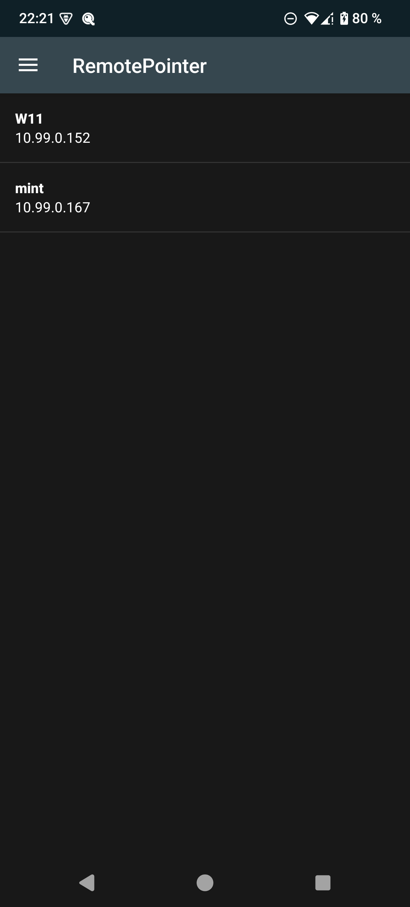
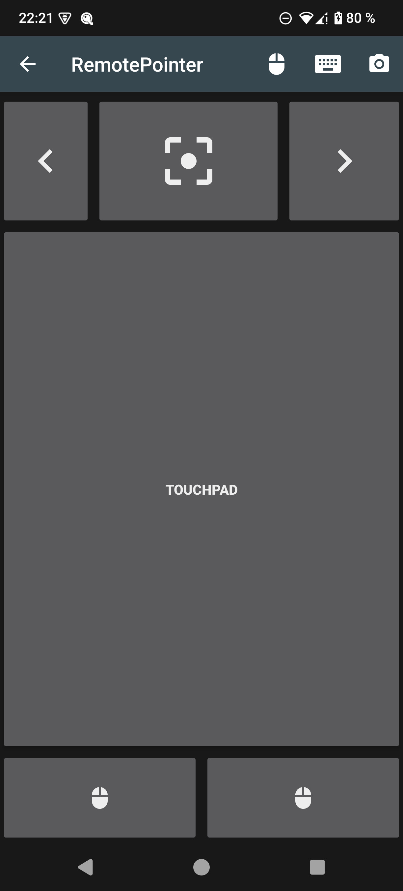
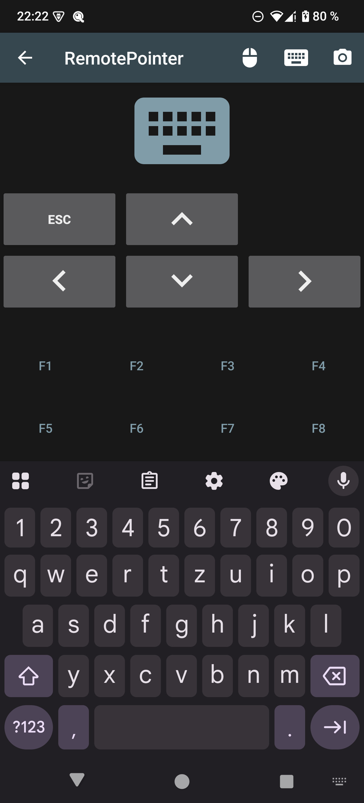
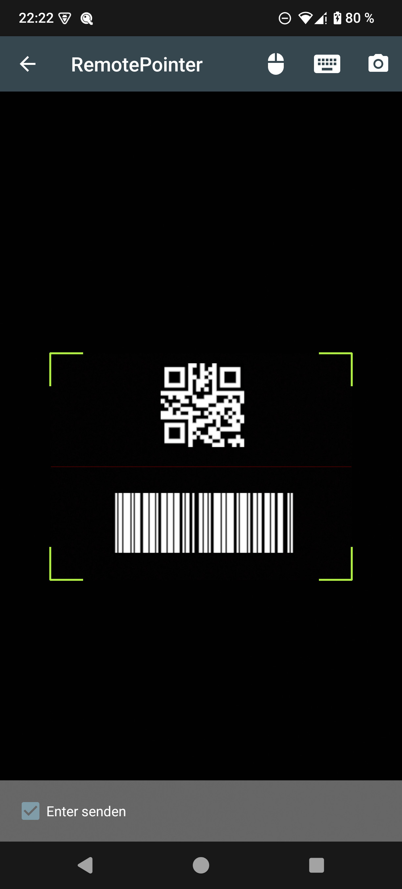

# RemotePointer-Android (Client/App)

Client application for the [RemotePointer Server](https://github.com/schorschii/RemotePointer-Server).

With RemotePointer you can use your smartphone to control your Linux, macOS or Windows computer's keyboard and mouse (using a touchpad). In addition to that, you can project a digital laser pointer dot on your screen or projector, which is controlled by the movement of your Android device. Furthermore, you can use your smartphone as barcode/QR code scanner for your computer.

The goal of this project is to provide an easy-to-use, platform independent, open source remote control application without dependencies to external servers and without tracking. If you like this project, please support the development by purchasing one of the in-app purchases in the Play Store or via Github sponsoring if you use the direct APK download.

